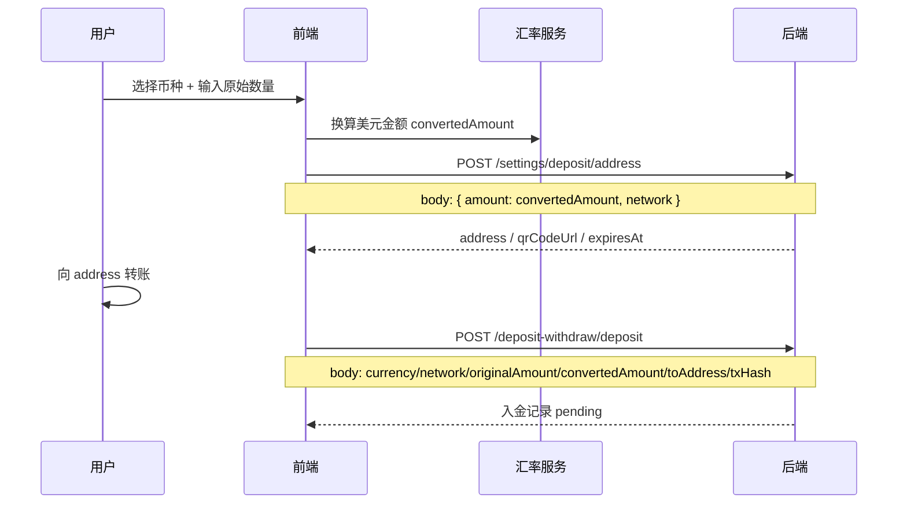

# 入金地址 - 前端集成文档

本文档包含两部分：

1. **用户端**：拿地址、提交入金、查询入金记录
2. **管理端**：入金地址池 CRUD、风控检测

## 基础信息

- **Base URL**: `/api`
- **Content-Type**: `application/json`

| 端 | 鉴权 |
|---|---|
| 用户端接口 | 用户 JWT，`Authorization: Bearer <user_token>` |
| 管理端接口 | 管理员 JWT（`admin` 角色），`Authorization: Bearer <admin_token>` |

---

# 用户端 - 入金流程

## 一、业务概览

入金流程分两步：

1. **拿地址**：按网络和换算后的美元金额，从地址池分配一个收款地址
2. **提交入金**：用户链上转账后，提交 txHash 和实际转入信息

前端负责：

- 展示可选币种：`BTC` / `ETH` / `USDC` / `USDT`
- 调用外部汇率服务，把原始币数量换算成美元
- 根据币种映射网络，调用后端拿地址
- 用户转账完成后，提交入金记录

后端负责：

- 按 `network + amount` 分配地址
- 写入 30 分钟占位锁
- 校验地址格式、币种/网络组合、占位锁是否有效
- 创建待审核入金记录

---

## 二、币种与网络映射

前端选择币种后，必须映射到对应网络：

| 用户选择 currency | 请求 network | 地址格式 |
|---|---|---|
| `BTC` | `BTC` | `1...` / `3...` / `bc1...` |
| `ETH` | `ERC20` | `0x` + 40 位 hex |
| `USDC` | `ERC20` | `0x` + 40 位 hex |
| `USDT` | `TRC20` | `T...`（34 位） |

推荐前端常量：

```ts
export const DEPOSIT_CURRENCY_NETWORK_MAP = {
  BTC: 'BTC',
  ETH: 'ERC20',
  USDC: 'ERC20',
  USDT: 'TRC20',
} as const;

export type DepositCurrency = keyof typeof DEPOSIT_CURRENCY_NETWORK_MAP;
export type DepositNetwork = (typeof DEPOSIT_CURRENCY_NETWORK_MAP)[DepositCurrency];
```

---

## 三、完整流程



---

## 四、接口说明

### 1. 获取入金地址

**端点**: `POST /api/settings/deposit/address`

**用途**: 按网络和美元金额，从地址池分配一个可用收款地址，并创建 30 分钟占位锁。

**请求体**:

```json
{
  "amount": 100,
  "network": "BTC"
}
```

| 字段 | 类型 | 必填 | 说明 |
|---|---|---|---|
| `amount` | number | 是 | 换算后的美元金额，必须 > 0 |
| `network` | string | 否 | `TRC20` / `ERC20` / `BTC`，不传默认 `TRC20` |

**成功响应** (200):

```json
{
  "data": {
    "network": "BTC",
    "address": "bc1qxy2kgdygjrsqtzq2n0yrf2493p83kkfjhx0wlh",
    "qrCodeUrl": "https://example.com/qrcode/btc-001.png",
    "expiresAt": "2026-05-29T09:00:00.000Z"
  }
}
```

| 字段 | 说明 |
|---|---|
| `network` | 实际分配的网络 |
| `address` | 收款地址 |
| `qrCodeUrl` | 二维码图片 URL |
| `expiresAt` | 占位锁过期时间，30 分钟内有效 |

**前端建议**:

- 拿到地址后，缓存以下字段直到提交成功或过期：
  - `network`
  - `address`
  - `convertedAmount`（必须与拿地址时传的 `amount` 完全一致）
  - `expiresAt`
- 页面展示倒计时，过期后提示用户重新获取地址

---

### 2. 提交入金

**端点**: `POST /api/deposit-withdraw/deposit`

**用途**: 用户链上转账完成后，提交 txHash 和入金详情。

**请求体**:

```json
{
  "currency": "BTC",
  "network": "BTC",
  "originalAmount": 0.001,
  "convertedAmount": 100,
  "txHash": "a1b2c3d4e5f6...",
  "toAddress": "bc1qxy2kgdygjrsqtzq2n0yrf2493p83kkfjhx0wlh",
  "remark": "optional"
}
```

| 字段 | 类型 | 必填 | 说明 |
|---|---|---|---|
| `currency` | string | 是 | `BTC` / `ETH` / `USDC` / `USDT` |
| `network` | string | 是 | `BTC` / `ERC20` / `TRC20` |
| `originalAmount` | number | 是 | 用户实际转入的原始币数量，必须 > 0 |
| `convertedAmount` | number | 是 | 前端换算后的美元金额，必须 > 0 |
| `txHash` | string | 是 | 链上交易哈希 |
| `toAddress` | string | 是 | 必须是刚才拿到的地址 |
| `remark` | string | 否 | 备注 |

**成功响应** (201):

```json
{
  "id": "uuid",
  "type": "deposit",
  "amount": 100,
  "currency": "BTC",
  "originalAmount": 0.001,
  "convertedAmount": 100,
  "status": "pending",
  "date": "2026-05-29T08:30:00.000Z",
  "network": "BTC",
  "method": "BTC · TXID: a1b2c3d4...",
  "txHash": "a1b2c3d4...",
  "toAddress": "bc1qxy2kgdygjrsqtzq2n0yrf2493p83kkfjhx0wlh",
  "editedToAddress": null,
  "effectiveToAddress": "bc1qxy2kgdygjrsqtzq2n0yrf2493p83kkfjhx0wlh",
  "remark": null,
  "reviewNote": null,
  "reviewedAt": null,
  "reviewedBy": null,
  "reviewerName": null,
  "balanceApplied": false,
  "beforeRealBalance": null,
  "afterRealBalance": null
}
```

**字段说明**:

| 字段 | 说明 |
|---|---|
| `amount` | 美元入账金额，等于 `convertedAmount` |
| `originalAmount` | 用户原始转入数量 |
| `convertedAmount` | 换算后的美元金额 |
| `status` | `pending` / `completed` / `failed` |

**旧数据兼容**:

- 旧入金记录没有 `currency` 时，后端返回 `USDT`
- 旧记录没有 `originalAmount` / `convertedAmount` 时，后端用 `amount` 兜底

---

### 3. 查询入金记录

**端点**: `GET /api/deposit-withdraw`

**Query 参数**:

| 参数 | 类型 | 说明 |
|---|---|---|
| `page` | number | 页码，默认 1 |
| `limit` | number | 每页条数，默认 20，最大 100 |
| `type` | string | `deposit` / `withdraw` |
| `status` | string | `pending` / `completed` / `failed` |

**示例**:

```http
GET /api/deposit-withdraw?type=deposit&page=1&limit=20
```

**成功响应**:

```json
{
  "data": [
    {
      "id": "uuid",
      "type": "deposit",
      "amount": 100,
      "currency": "USDC",
      "originalAmount": 100,
      "convertedAmount": 100,
      "status": "pending",
      "date": "2026-05-29T08:30:00.000Z",
      "network": "ERC20",
      "txHash": "0xabc...",
      "toAddress": "0x1234..."
    }
  ],
  "total": 1,
  "page": 1,
  "limit": 20
}
```

---

## 五、各币种示例

### BTC

**拿地址**:

```json
{
  "amount": 100,
  "network": "BTC"
}
```

**提交入金**:

```json
{
  "currency": "BTC",
  "network": "BTC",
  "originalAmount": 0.001,
  "convertedAmount": 100,
  "txHash": "64位hex",
  "toAddress": "bc1..."
}
```

### ETH

**拿地址**:

```json
{
  "amount": 180,
  "network": "ERC20"
}
```

**提交入金**:

```json
{
  "currency": "ETH",
  "network": "ERC20",
  "originalAmount": 0.05,
  "convertedAmount": 180,
  "txHash": "0x...",
  "toAddress": "0x..."
}
```

### USDC

**拿地址**:

```json
{
  "amount": 100,
  "network": "ERC20"
}
```

**提交入金**:

```json
{
  "currency": "USDC",
  "network": "ERC20",
  "originalAmount": 100,
  "convertedAmount": 100,
  "txHash": "0x...",
  "toAddress": "0x..."
}
```

### USDT（旧流程兼容）

**拿地址**:

```json
{
  "amount": 100,
  "network": "TRC20"
}
```

**提交入金**:

```json
{
  "currency": "USDT",
  "network": "TRC20",
  "originalAmount": 100,
  "convertedAmount": 100,
  "txHash": "...",
  "toAddress": "T..."
}
```

---

## 六、前端状态建议

建议前端维护一个入金上下文对象：

```ts
type DepositSession = {
  currency: 'BTC' | 'ETH' | 'USDC' | 'USDT';
  network: 'BTC' | 'ERC20' | 'TRC20';
  originalAmount: number;
  convertedAmount: number;
  address: string;
  qrCodeUrl: string;
  expiresAt: string;
};
```

关键规则：

1. `convertedAmount` 在「拿地址」和「提交入金」时必须完全一致
2. `toAddress` 必须是当前 session 里拿到的地址
3. `network` 必须与 `currency` 映射一致
4. 超过 `expiresAt` 后必须重新拿地址，不能直接提交

推荐前端封装：

```ts
function getNetworkByCurrency(currency: DepositCurrency): DepositNetwork {
  return DEPOSIT_CURRENCY_NETWORK_MAP[currency];
}

async function allocateDepositAddress(params: {
  currency: DepositCurrency;
  convertedAmount: number;
}) {
  const network = getNetworkByCurrency(params.currency);

  const res = await api.post('/settings/deposit/address', {
    amount: params.convertedAmount,
    network,
  });

  return {
    ...res.data,
    currency: params.currency,
    convertedAmount: params.convertedAmount,
  };
}
```

---

## 七、地址格式校验（前端可选）

后端会校验，前端可提前拦截：

| network | 正则 |
|---|---|
| `TRC20` | `/^T[1-9A-HJ-NP-Za-km-z]{33}$/` |
| `ERC20` | `/^0x[a-fA-F0-9]{40}$/` |
| `BTC` | `/^(bc1[a-z0-9]{39,59}\|[13][1-9A-HJ-NP-Za-km-z]{25,34})$/` |

---

## 八、错误码

错误响应格式：

```json
{
  "statusCode": 409,
  "timestamp": "2026-05-29T08:30:00.000Z",
  "path": "/api/deposit-withdraw/deposit",
  "code": "DEPOSIT_ALLOCATION_EXPIRED",
  "message": "入金地址已过期或未获取，请重新获取后再提交"
}
```

| code | HTTP | 场景 | 前端处理建议 |
|---|---|---|---|
| `NO_AVAILABLE_DEPOSIT_ADDRESS` | 409 | 当前 network + amount 没有可用地址 | 提示换金额或联系客服 |
| `DEPOSIT_ALLOCATION_EXPIRED` | 409 | 占位锁过期或未获取 | 重新调用拿地址接口 |
| `INVALID_DEPOSIT_ADDRESS` | 400 | 地址不存在或 network 不匹配 | 清空当前地址，重新获取 |
| `DEPOSIT_ADDRESS_UNAVAILABLE` | 409 | 地址被禁用或风控标记 risky | 重新获取地址 |
| `INVALID_CURRENCY_NETWORK` | 400 | currency 和 network 组合错误 | 检查前端映射逻辑 |
| `INVALID_ADDRESS` | 400 | 地址格式错误 | 前端表单校验 |
| `DUPLICATE_TX_HASH` | 409 | txHash 已提交过 | 提示勿重复提交 |
| `TX_HASH_REQUIRED` | 400 | txHash 为空 | 前端必填校验 |
| `INVALID_AMOUNT` | 400 | 金额非法 | 前端必填/正数校验 |
| `VALIDATION_ERROR` | 400 | DTO 校验失败 | 检查字段是否齐全 |

---

## 九、前端注意事项

### 1. 金额精度

占位锁按 **精确金额** 匹配：

- 拿地址时传 `amount: 100`
- 提交时必须传 `convertedAmount: 100`

如果前端换算后出现 `100.00000001`，会导致提交失败。  
建议：

- 拿地址和提交共用同一个 `convertedAmount` 变量
- 必要时固定小数位（如 2 位或 8 位）

### 2. 占位锁 30 分钟

- 拿地址后开始计时
- 过期后必须重新拿地址
- 后端每分钟自动清理过期占位

### 3. 汇率由前端负责

后端不会校验 `originalAmount` 和 `convertedAmount` 的换算关系，只保存前端提交的值。

### 4. 余额入账金额

后端实际入账金额是 `convertedAmount`（响应里的 `amount` 与其一致）。

### 5. 旧 USDT 流程

如果前端暂时只改 BTC / ETH / USDC，USDT 仍可按旧逻辑：

- `network = TRC20`
- `originalAmount = convertedAmount`

---

## 十、推荐页面流程

1. 用户选择币种
2. 输入原始数量 `originalAmount`
3. 前端调用汇率服务得到 `convertedAmount`
4. 调 `POST /settings/deposit/address`
5. 展示 `address`、`qrCodeUrl`、倒计时
6. 用户完成链上转账
7. 用户填写 `txHash`
8. 调 `POST /deposit-withdraw/deposit`
9. 跳转入金记录页，展示 `pending` 状态

---

## 十一、用户端联调 Checklist

- [ ] BTC 拿地址返回 `bc1` / `1` / `3` 地址
- [ ] ETH / USDC 拿地址返回 `0x` 地址
- [ ] USDT 拿地址返回 `T` 地址
- [ ] 拿地址和提交使用同一个 `convertedAmount`
- [ ] 30 分钟过期后能正确提示并重新拿地址
- [ ] 重复 txHash 会返回 `DUPLICATE_TX_HASH`
- [ ] 入金记录列表能正确展示 `currency / originalAmount / convertedAmount / network`
- [ ] 旧 USDT 记录展示正常（currency 默认 USDT）

---

# 管理端 - 入金地址管理

## 十二、业务概览

管理端用于维护入金地址池。用户端拿地址时，后端会按 `network + amount` 从地址池中挑选可用地址。

每个地址包含：

- **网络** `network`：决定这条地址属于哪条链
- **金额区间** `minAmount` / `maxAmount`：单次分配允许的美元金额范围
- **总容量** `capacity`：该地址累计可接收的美元总额上限
- **已用额度** `usedAmount`：已审核通过的累计金额
- **占用额度** `pendingAmount`：占位锁 + 待审核中的累计金额
- **剩余额度** `remainingAmount`：还可继续分配的金额
- **启用状态** `enabled`
- **风控状态** `riskStatus`

---

## 十三、管理端接口列表

| 方法 | 路径 | 说明 |
|---|---|---|
| `GET` | `/api/admin/settings/deposit/addresses` | 获取地址池列表 |
| `POST` | `/api/admin/settings/deposit/addresses` | 新增地址 |
| `PUT` | `/api/admin/settings/deposit/addresses/:id` | 更新地址配置 |
| `DELETE` | `/api/admin/settings/deposit/addresses/:id` | 删除地址 |
| `POST` | `/api/admin/settings/deposit/addresses/:id/risk-check` | 手动触发风控检测 |

**权限要求**：管理员登录后获取 token

```http
POST /api/admin/auth/login
Content-Type: application/json

{
  "username": "admin",
  "password": "******"
}
```

---

## 十四、地址对象字段说明

列表和详情接口返回的地址对象结构如下：

```json
{
  "id": "uuid",
  "network": "BTC",
  "address": "bc1qxy2kgdygjrsqtzq2n0yrf2493p83kkfjhx0wlh",
  "qrCodeUrl": "https://example.com/qrcode/btc-001.png",
  "minAmount": "10",
  "maxAmount": "5000",
  "capacity": "50000",
  "usedAmount": "1200",
  "pendingAmount": "300",
  "remainingAmount": "48500",
  "enabled": true,
  "riskStatus": "SAFE",
  "lastRiskCheckAt": "2026-05-29T08:00:00.000Z",
  "sortOrder": 0,
  "createdAt": "2026-05-01T00:00:00.000Z",
  "updatedAt": "2026-05-29T08:00:00.000Z"
}
```

| 字段 | 类型 | 说明 |
|---|---|---|
| `id` | string | 地址 ID |
| `network` | string | `TRC20` / `ERC20` / `BTC` |
| `address` | string | 收款地址 |
| `qrCodeUrl` | string | 二维码图片 URL |
| `minAmount` | string | 单次分配最小美元金额 |
| `maxAmount` | string \| null | 单次分配最大美元金额，`null` 表示无上限 |
| `capacity` | string \| null | 地址总容量上限，`null` 表示无上限 |
| `usedAmount` | string | 已审核通过累计金额 |
| `pendingAmount` | string | 占位锁 + 待审核累计金额 |
| `remainingAmount` | string \| null | 剩余可分配额度；`capacity` 为 null 时返回 null |
| `enabled` | boolean | 是否启用 |
| `riskStatus` | string | `UNKNOWN` / `SAFE` / `RISKY` |
| `lastRiskCheckAt` | string \| null | 最近一次风控检测时间 |
| `sortOrder` | number | 排序值，越小越优先分配 |
| `createdAt` | string | 创建时间 |
| `updatedAt` | string | 更新时间 |

**前端展示建议**：

- 列表页按 `network` 分组或提供 Tab 筛选
- `remainingAmount = null` 时展示为「无上限」
- `riskStatus = RISKY` 时高亮，且该地址不会被分配给用户
- `pendingAmount > 0` 时禁用删除按钮

---

## 十五、获取地址池列表

**端点**: `GET /api/admin/settings/deposit/addresses`

**成功响应**:

```json
{
  "data": [
    {
      "id": "uuid",
      "network": "ERC20",
      "address": "0x1234567890abcdef1234567890abcdef12345678",
      "qrCodeUrl": "https://example.com/qrcode/eth-001.png",
      "minAmount": "10",
      "maxAmount": "10000",
      "capacity": "100000",
      "usedAmount": "5000",
      "pendingAmount": "1000",
      "remainingAmount": "94000",
      "enabled": true,
      "riskStatus": "UNKNOWN",
      "lastRiskCheckAt": null,
      "sortOrder": 0,
      "createdAt": "2026-05-01T00:00:00.000Z",
      "updatedAt": "2026-05-29T08:00:00.000Z"
    }
  ]
}
```

**说明**：

- 默认按 `sortOrder ASC, createdAt ASC` 排序
- 当前接口无分页，前端自行筛选/分页

---

## 十六、新增地址

**端点**: `POST /api/admin/settings/deposit/addresses`

**请求体**:

```json
{
  "network": "BTC",
  "address": "bc1qxy2kgdygjrsqtzq2n0yrf2493p83kkfjhx0wlh",
  "qrCodeUrl": "https://example.com/qrcode/btc-001.png",
  "minAmount": 10,
  "maxAmount": 5000,
  "capacity": 50000,
  "enabled": true,
  "sortOrder": 0
}
```

| 字段 | 类型 | 必填 | 说明 |
|---|---|---|---|
| `network` | string | 否 | `TRC20` / `ERC20` / `BTC`，默认 `TRC20` |
| `address` | string | 是 | 收款地址，按 network 校验格式 |
| `qrCodeUrl` | string | 是 | 二维码图片 URL |
| `minAmount` | number | 是 | 单次分配最小美元金额，>= 0 |
| `maxAmount` | number \| null | 否 | 单次分配最大美元金额，`null` 表示无上限 |
| `capacity` | number \| null | 否 | 地址总容量上限，`null` 表示无上限 |
| `enabled` | boolean | 否 | 默认 `true` |
| `sortOrder` | number | 否 | 默认 `0` |

**地址格式校验**：

| network | 格式 |
|---|---|
| `TRC20` | `T` 开头，34 位 |
| `ERC20` | `0x` + 40 位 hex |
| `BTC` | `1...` / `3...` / `bc1...` |

**成功响应**:

```json
{
  "data": {
    "id": "uuid",
    "network": "BTC",
    "address": "bc1qxy2kgdygjrsqtzq2n0yrf2493p83kkfjhx0wlh",
    "qrCodeUrl": "https://example.com/qrcode/btc-001.png",
    "minAmount": "10",
    "maxAmount": "5000",
    "capacity": "50000",
    "usedAmount": "0",
    "pendingAmount": "0",
    "remainingAmount": "50000",
    "enabled": true,
    "riskStatus": "UNKNOWN",
    "lastRiskCheckAt": null,
    "sortOrder": 0,
    "createdAt": "2026-05-29T08:30:00.000Z",
    "updatedAt": "2026-05-29T08:30:00.000Z"
  }
}
```

**注意**：

- 创建后 **不能修改** `network` 和 `address`
- 若地址重复，返回 `DEPOSIT_ADDRESS_EXISTS`
- 若 `maxAmount < minAmount`，返回 `INVALID_DEPOSIT_RANGE`

---

## 十七、更新地址

**端点**: `PUT /api/admin/settings/deposit/addresses/:id`

**可更新字段**：

```json
{
  "qrCodeUrl": "https://example.com/qrcode/btc-001-v2.png",
  "minAmount": 20,
  "maxAmount": 8000,
  "capacity": 80000,
  "enabled": false,
  "sortOrder": 1
}
```

| 字段 | 类型 | 必填 | 说明 |
|---|---|---|---|
| `qrCodeUrl` | string | 否 | 二维码 URL |
| `minAmount` | number | 否 | 最小金额 |
| `maxAmount` | number \| null | 否 | 最大金额，传 `null` 表示取消上限 |
| `capacity` | number \| null | 否 | 总容量，传 `null` 表示取消上限 |
| `enabled` | boolean | 否 | 启用/停用 |
| `sortOrder` | number | 否 | 排序 |

**不可更新**：

- `network`
- `address`
- `usedAmount`
- `pendingAmount`
- `riskStatus`

**成功响应**：返回更新后的完整地址对象（结构同列表项）。

**前端建议**：

- 停用地址时弹确认框，提示「停用后用户无法再分配到该地址」
- 调小 `capacity` 前检查当前 `usedAmount + pendingAmount`

---

## 十八、删除地址

**端点**: `DELETE /api/admin/settings/deposit/addresses/:id`

**成功响应**:

```json
{
  "message": "入金地址已删除"
}
```

**删除限制**：

- 若 `pendingAmount > 0`，不允许删除
- 返回错误码 `DEPOSIT_ADDRESS_HAS_PENDING`

**前端建议**：

- 列表中 `pendingAmount !== "0"` 时隐藏或禁用删除按钮
- 删除前二次确认

---

## 十九、手动风控检测

**端点**: `POST /api/admin/settings/deposit/addresses/:id/risk-check`

**用途**：立即检测该地址风险状态。

**成功响应**:

```json
{
  "data": {
    "riskStatus": "SAFE"
  }
}
```

**riskStatus 取值**：

| 值 | 说明 |
|---|---|
| `UNKNOWN` | 未检测或不支持该网络检测 |
| `SAFE` | 安全 |
| `RISKY` | 风险地址，不会再分配给用户 |

**当前实现说明**：

- 仅 `TRC20` 地址会调用 OkLink 做页面检测
- `BTC` / `ERC20` 地址手动检测时返回 `UNKNOWN`
- 系统每 10 分钟自动检测启用的 `TRC20` 地址

**前端建议**：

- `TRC20` 地址显示「立即检测」按钮
- `BTC` / `ERC20` 可隐藏检测按钮，或点击后提示「当前网络暂不支持自动风控」
- `RISKY` 地址在列表中高亮展示

---

## 二十、地址分配规则（供管理端理解）

用户端拿地址时，后端筛选逻辑如下：

1. `network` 必须匹配
2. `enabled = true`
3. `riskStatus != RISKY`
4. `minAmount <= amount <= maxAmount`（maxAmount 为 null 时无上限）
5. 若设置了 `capacity`，则 `remainingAmount >= amount`
6. 优先分配该用户最近未使用过的地址
7. 同优先级下按 `sortOrder`、`createdAt` 排序

因此管理端配置建议：

| 场景 | 建议 |
|---|---|
| BTC 专用地址 | `network = BTC` |
| ETH / USDC 共用 | `network = ERC20` |
| USDT 旧地址 | `network = TRC20` |
| 大额入金 | 提高 `minAmount`，单独配置地址 |
| 热门地址 | 提高 `sortOrder` 优先级（数值更小） |

---

## 二十一、管理端错误码

| code | HTTP | 场景 | 前端处理建议 |
|---|---|---|---|
| `DEPOSIT_ADDRESS_EXISTS` | 409 | 地址重复 | 提示更换地址 |
| `DEPOSIT_ADDRESS_NOT_FOUND` | 404 | 地址不存在 | 刷新列表 |
| `DEPOSIT_ADDRESS_HAS_PENDING` | 409 | 有 pending 金额，不能删除 | 禁用删除并提示 |
| `INVALID_DEPOSIT_ADDRESS` | 400 | 地址格式不符合 network | 表单校验提示 |
| `INVALID_DEPOSIT_RANGE` | 400 | maxAmount < minAmount | 表单校验提示 |
| `VALIDATION_ERROR` | 400 | 参数校验失败 | 检查必填项 |

---

## 二十二、管理端页面建议

### 1. 列表页

建议列：

- 网络
- 地址
- 金额区间（min ~ max）
- 容量 / 已用 / 占用 / 剩余
- 启用状态
- 风控状态
- 排序
- 操作（编辑 / 删除 / 风控检测）

建议筛选：

- 按 `network` Tab：`全部 / TRC20 / ERC20 / BTC`
- 按 `enabled`
- 按 `riskStatus`

### 2. 新增/编辑弹窗

新增时字段：

- network（下拉）
- address
- qrCodeUrl
- minAmount
- maxAmount
- capacity
- enabled
- sortOrder

编辑时仅允许修改：

- qrCodeUrl
- minAmount / maxAmount / capacity
- enabled
- sortOrder

### 3. 表单校验示例

```ts
const ADDRESS_PATTERNS = {
  TRC20: /^T[1-9A-HJ-NP-Za-km-z]{33}$/,
  ERC20: /^0x[a-fA-F0-9]{40}$/,
  BTC: /^(bc1[a-z0-9]{39,59}|[13][1-9A-HJ-NP-Za-km-z]{25,34})$/,
};

function validateDepositAddressForm(form: {
  network: 'TRC20' | 'ERC20' | 'BTC';
  address: string;
  minAmount: number;
  maxAmount?: number | null;
}) {
  if (!ADDRESS_PATTERNS[form.network].test(form.address.trim())) {
    throw new Error(`${form.network} 地址格式不正确`);
  }
  if (form.maxAmount != null && form.maxAmount < form.minAmount) {
    throw new Error('最大金额不能小于最小金额');
  }
}
```

---

## 二十三、管理端联调 Checklist

- [ ] 能分别新增 `TRC20 / ERC20 / BTC` 地址
- [ ] 错误地址格式会被后端拒绝
- [ ] 列表正确展示 `network / remainingAmount / riskStatus`
- [ ] 编辑时可修改金额区间、容量、启用状态
- [ ] 编辑时不能修改 `network / address`
- [ ] `pendingAmount > 0` 时无法删除
- [ ] TRC20 地址可手动触发风控检测
- [ ] BTC / ERC20 地址风控检测返回 `UNKNOWN`
- [ ] 用户端拿地址时，只会分配到对应 network 的地址
